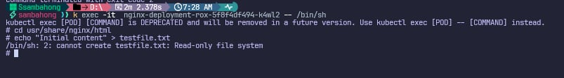
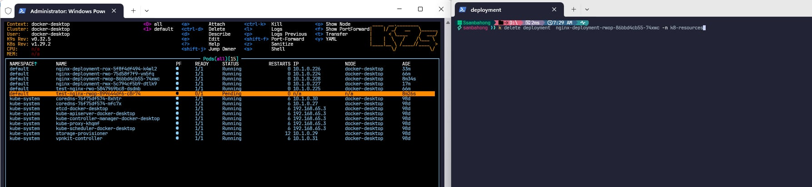
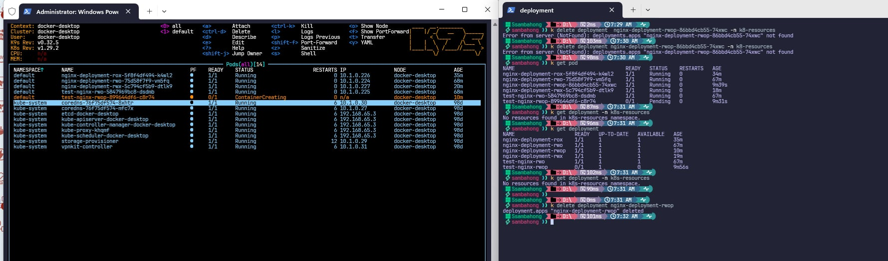

# Access Mode

## ReadWriteOnce

## ReadOnlyMany

## ReadWriteMany

## ReadWriteOncePod
- **Before**
  
- **After**
  

# CLI:

- **Access to container using this command:** `kubectl exec -it <nginx-pod-name> -- /bin/sh`